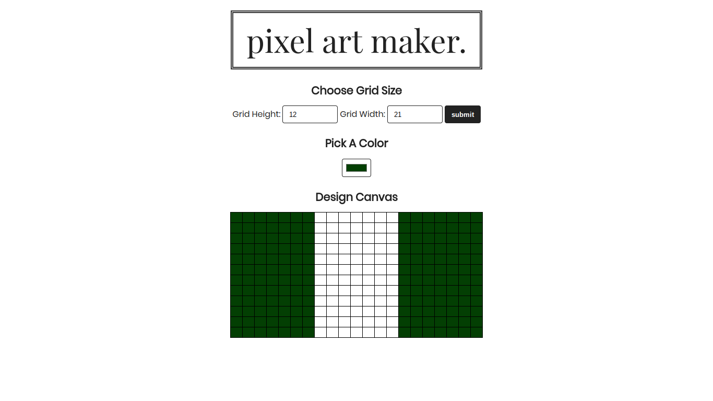
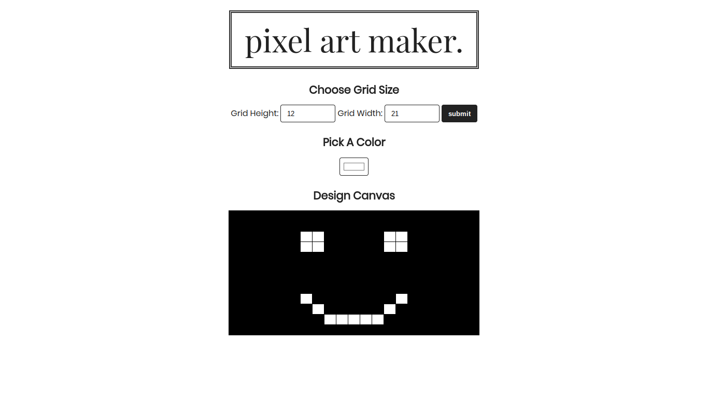
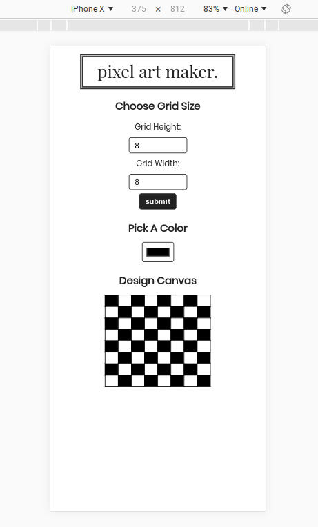

# Pixel Art Maker Udacity Project 

This is the final project for the ALC (Andela Learning Community) with Google 3.0
challenge scholarship.

With this project, we are required to build a single page web app which demonstrates 
the following skills learnt: 

* HTML,
* CSS,
* Foundational Javascript,
* DOM Interaction and manipulation with jQuery.

The _app_ can be used to create flags like this:

Or, hell, _smileys_ like this:

**Plus** it's also mobile responsive:

A live version of the project can be accessed here: [Kizito's Pixel Art Maker](https://akhilome.github.io/pixel-art-maker/).

Go, break some eggs.

## Style Guides:

The following style guides were adhered to in the development of the project:

* [CSS Style Guide](http://udacity.github.io/frontend-nanodegree-styleguide/css.html),
* [HTML Style Guide](http://udacity.github.io/frontend-nanodegree-styleguide/index.html),
* [Javascript Style Guide](http://udacity.github.io/frontend-nanodegree-styleguide/javascript.html),
* [Git Style Guide](https://udacity.github.io/git-styleguide/) 

